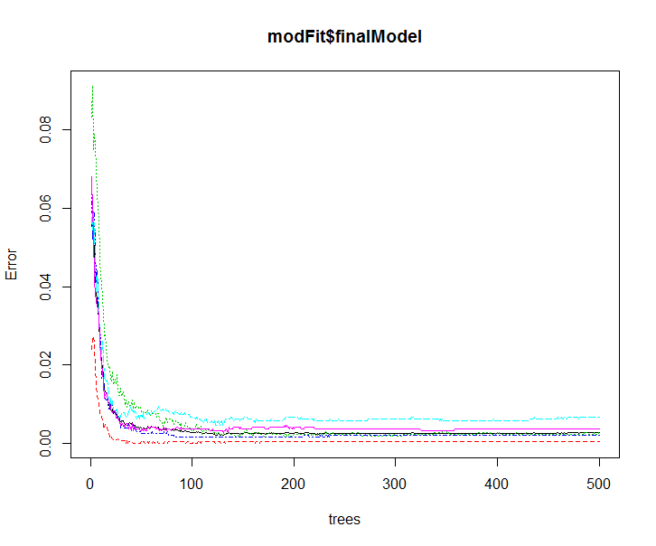

## Synopsis

Using accelerometer data collected from 6 participants with sensors on belt, arm, and dumbbell and instructed to do a set of exercises in a range of quality from bad to good. This paper describes a set of machine learning techniques applied to the collected training data in hopes of accuracy predicting the exercise quality. Several attempts were attempted using various techniques with the final result using random forest.

*NOTE*: I wished to also experiment with running R on **Amazon Web Services** to leverage much greater compute ability. I'll provide some details on the server capability used to produce my results along with a separate document on how to setup an AWS instance for R processing and using RStudio remotely. The final model was fitted using a 16 virtual CPU machine with 122 Gbytes of RAM using the caret package train function configured to run 122 minutes. Also an effort to leverage as many cores as possible was made using the doParallel package. (I did not have the time or cash to try a AWS cluster of machines...but this would be a very interesting next step in this study). This implies that if you wish to reproduce my model fit, you will probably need to run my finial train tune parameters on a very large machine.

I was hoping for an accuracy in the 90% range and actually produced a in-train accuracy of slightly above 99%

The final model fit was performed with random forest for a training accuracy of 99.69%, Kappa of 0.9961 and a validation accuracy of 99.68% (an indication of out-of-sample accuracy)

**Last Minute Update**: Just before deadline, I tried a Stochastic Gradient Boosting algorithm that produced 99.29%-99.40% accuracy within a couple minutes of training (on a multi core machine) depending on seed. This was after reducing the input data set to only the following columns (all, except for num_window, show relatively high variance):
```{r,eval=FALSE}
savenames <- c("num_window","roll_belt","pitch_belt","yaw_belt","roll_arm","pitch_arm","yaw_arm","roll_forearm","pitch_forearm","yaw_forearm","classe")
useIndexs <- which(names(cleandata) %in% savenames)
cleandata3 <- cleandata[,useIndexs]
set.seed(5436)
modelFitGBM <- train(classe ~.,data=cleantraining3, method="gbm", verbose=FALSE) #winner at 99.4% in time 95.5 seconds to train
modelFitGBM
saveRDS(modelFitGBM,"modelFitGBM.rds")
```
Too late to update this report, but I'll suggest that this result along with the random forest might be a good choice to stack (combining predictors)

**Really Last minute update**: Adjusting my features now gets me a 99.8% accuracy (I'll leave the rds file in my repository)

### Additional Details and Notes

* The original study of Human Activity Recognition can be found here <http://groupware.les.inf.puc-rio.br/har>.
* A description of how I setup an AWS instance to run R can be found here: <http://pmpartch.github.io/MachineLearning_project/RonAWS.html>

## Data Processing
The following sections describe the cleaning and factoring of the data into a training set and verification set. Some preliminary exploratory views of the data and then the model training. Note that due to how I generated the model, it will not be feasible to replicate the work on a home machine. I'll provide a stand alone R script that can be run on an AWS server if one cares to do so (it will take 121 minutes of processing).

```{r, echo=FALSE}

if (require("knitr", warn.conflicts=FALSE, quietly=TRUE) == FALSE)
{
    install.packages("knitr", repos = 'http://cran.us.r-project.org')
    library(knitr)
}

opts_chunk$set(echo = TRUE) #yes, I know this is default, but I wished to demo how to setup up global settings

if (require("caret", warn.conflicts=FALSE, quietly=TRUE) == FALSE)
{
    install.packages("caret", dependencies = c("Depends", "Suggests"))
    library(caret)
}

```
### Cleaning
The original training data has several columns that were considered not useful (say, using engineering judgement). So, I cleaned the data of columns that were mostly NA or empty (mostly meaning less than 10% data) and removed the first 6 columns (user name, new window data, and time of sample data). (At the last minute I tested with num_window column to produce a even better result so I've added it back in.). 
```{r}
#read training data and replace "#DIV/0!" with "NA"
traingdata <- read.csv("pml-training.csv", na.strings=c("#DIV/0!","NA"))

#remove columns with mostly no data (90% NA)
trainnacols <- traingdata[,colSums(is.na(traingdata))>nrow(traingdata)/10]

#find index of columns with high counts of NA's
naIndexs <- which(names(traingdata) %in% names(trainnacols))

#I'm also going to remove unused columns (X, user_name, time stamps and new window: column indexs: 1:6)
naIndexs <- append(1:6, naIndexs)

#now remove these columns from the dataset
cleandata <- traingdata[,-naIndexs]
```
Now using the caret package to split the provide training data into a training/verification split (so I can avoid using the provided test data until the very end of this exploratory exercise).
```{r}
set.seed(12345)
inTrain <- createDataPartition(y=cleandata$classe, p=0.6, list=FALSE)

cleantraining <- cleandata[inTrain,]
cleantesting <- cleandata[-inTrain,]
```

###Exploritory analysis
Now examine the cleaned data to see if there are any issues with zero variance
```{r}
nearZeroVar(cleantraining,saveMetrics=TRUE)
```

###Model analysis
```{r,echo=FALSE}

modFit <- readRDS("rfFullModel2b.rds") #load the selected model fit

```
I tried an number of classification techniques but quickly selected and concentrated on random forest. The additional work done can be found in my github repository (see the _Project.R_ file for the original work. Also look at _Project Remote.R_ for the turning work specifically done using random forest). The tuning work done was an effort to increase the cross-validation and random predictor selection done by caret train (since I had the CPU and memory horsepower on AWS, why not?) Here is the dump of the selected model fit using the following turning parameters for caret train:
```{r,eval=FALSE}
set.seed(4532)
ctrl <- trainControl(method = "repeatedcv", repeats = 5)
modFit <- train(classe ~ ., data = cleantraining, method = "rf",prox=TRUE, trControl = ctrl, tuneLength=6) #took 7284.488 seconds to train
```
The model fit shows the following results and plot
```{r,echo=FALSE}
modFit
plot(modFit)
```

###final model selection and results

Final Model confusion matrix, error plots:
```{r,echo=FALSE}

modFit$finalModel$confusion

#plot(modFit$finalModel) for some reason this will not process via Knitr. So I'll embed the plot explicity
```


